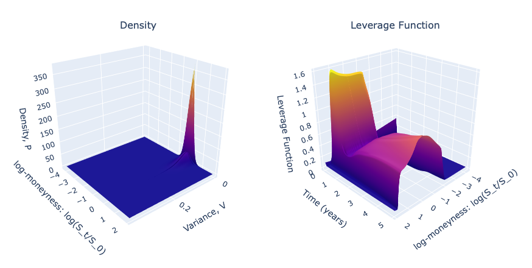

# SLV_Calibration

Full SLV Calibration procedure on FX options data.

The implied volatility surface was interpolated and extrapolated such that it was arbitrage-free using quasi-SVI. Then the local volatility surface was generated from the arbitage-free surface, featured below.


Then using Levenbergd-Marquardt algorithm, the pure Heston Dynamics were calibrated. Afterwards, the Kolmorogov-Forward Equation was solved to find the transition probability density function, which was then used to retrieve the Leverage function. 




Then using the Monte Carlo method, the Vanilla options were priced and the implied vol was backed-out and compared to the initial market data, the RMSE was: 0.04675.

Sources:

Lorenzo Bergomi, (2015), "Stochastic Volatility Modeling." 

Iain, J, Clark (2010), "Foreign Exchange Option Pricing: A Practitioner's Guide."

Jim Gatheral (2006), "The Volatility Surface."

Zhu, et al (2014), "FX Option Pricing with Stochastic-Local Volatility Model. 

Zeliade Systems (2009), "Quasi-Explicit Calibration of Gatheral's SVI model."

Dependencies:
```
pip install yfinance
pip install py_vollib_vectorized
```
