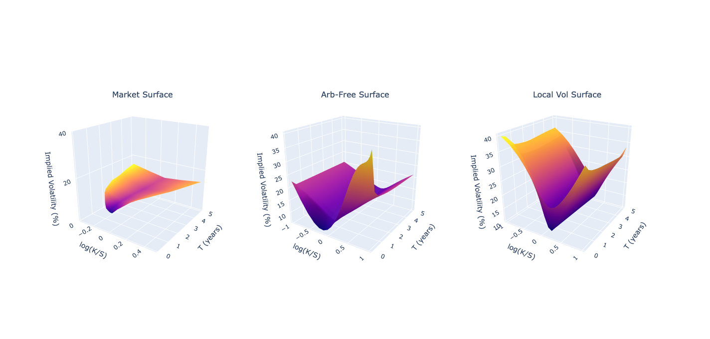

# SLV_Calibration

Full SLV Calibration procedure on FX options data.

Includes creating an arbtirage free IV surface with interpolation and extrapolation to retrieve the local volatility surface.
Calibrates the Heston Dynamics using Levenbergd-Marquardt from my Heston_calibration repository.
Uses the Forward-Kolmorogov Equation to solve the transition probability density function and retrieve the Leverage function. 




Sources:

Lorenzo Bergomi, (2015), "Stochastic Volatility Modeling." 

Iain, J, Clark (2010), "Foreign Exchange Option Pricing: A Practitioner's Guide."

Jim Gatheral (2006), "The Volatility Surface."

Zhu, et al (2014), "FX Option Pricing with Stochastic-Local Volatility Model. 

Zeliade Systems (2009), "Quasi-Explicit Calibration of Gatheral's SVI model."

Dependencies:
```
pip install yfinance
pip install py_vollib_vectorized
```
